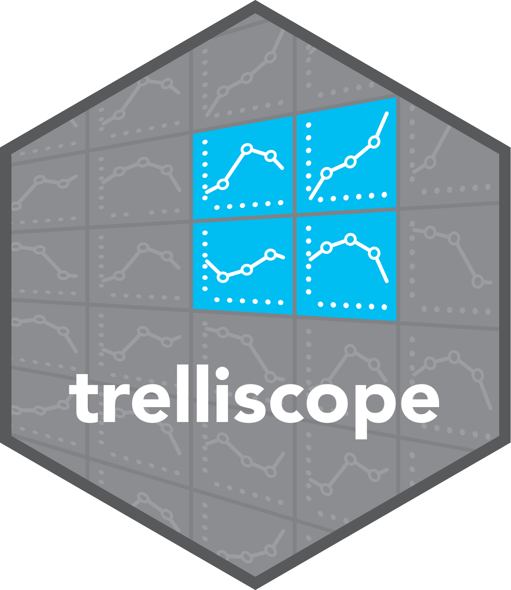

# trelliscope 

<!-- badges: start -->
[](https://github.com/trelliscope/trelliscope/actions/workflows/R-CMD-check.yaml)
[](https://app.codecov.io/gh/trelliscope/trelliscope?branch=main)
<!-- badges: end -->

Trelliscope is an R package that enables interactive exploration of data frames of visualizations.

## Installation

``` r
remotes::install_github("trelliscope/trelliscope")
```

## Usage

Trelliscope provides utilities for you to create and visualize data frames of visualizations. The visualizations can be anything you can produce in R, but can also simply be links to images that have already been created.

As a simple example, the package comes with an example data frame of links to Mars [Curiousity Rover](https://mars.nasa.gov/msl/home/) images.

``` r
library(trelliscope)

mars_rover
```

``` r
#> # A tibble: 1,245 × 5
#>    camera                  sol earth_date class   img_src
#>    <chr>                 <int> <chr>      <chr>   <chr>
#>  1 Mars Hand Lens Imager   565 2014-03-09 horizon http://mars.jpl.nasa.gov/m…
#>  2 Mars Hand Lens Imager   565 2014-03-09 horizon http://mars.jpl.nasa.gov/m…
#>  3 Mars Hand Lens Imager   568 2014-03-12 wheel   http://mars.jpl.nasa.gov/m…
#>  4 Mars Hand Lens Imager   568 2014-03-12 wheel   http://mars.jpl.nasa.gov/m…
#>  5 Mars Hand Lens Imager   568 2014-03-12 wheel   http://mars.jpl.nasa.gov/m…
#> # … with 1,240 more rows
```

Each row represents one image taken by the rover with some associated metadata.

Casting this data frame as a trelliscope data frame gives us the ability to build an interactive display.

``` r
d <- as_trelliscope_df(mars_rover, name = "mars rover")
d
```

``` r
#> ℹ Trelliscope data frame. Call show_info() for more information
#> # A tibble: 1,245 × 5
#>    camera                  sol earth_date class   img_src
#>    <chr>                 <int> <chr>      <chr>   <chr>
#>  1 Mars Hand Lens Imager   565 2014-03-09 horizon http://mars.jpl.nasa.gov/m…
#>  2 Mars Hand Lens Imager   565 2014-03-09 horizon http://mars.jpl.nasa.gov/m…
#>  3 Mars Hand Lens Imager   568 2014-03-12 wheel   http://mars.jpl.nasa.gov/m…
#>  4 Mars Hand Lens Imager   568 2014-03-12 wheel   http://mars.jpl.nasa.gov/m…
#>  5 Mars Hand Lens Imager   568 2014-03-12 wheel   http://mars.jpl.nasa.gov/m…
#> # … with 1,240 more rows
```

With no additional configuration, we can simply view the images referenced by the `img_src` column and interactively navigate them using the provided metadata with the following:

``` r
view_trelliscope(d)
```

[](https://user-images.githubusercontent.com/1275592/229949930-59a84582-a09f-4aa5-99fd-cbfb9f0eea8f.png)

This scratches the surface of the functions found in the package. By beginning with [this tutorial](https://trelliscope.org/trelliscope/index.html), you can dive deeper into topics including:

- Creating and viewing data frames of visualizations created in R (e.g. ggplot2, htmlwidgets)
- Fine control over metadata
- Setting the initial view of the app
- Providing a set of pre-determined views for the user to 
- Specifying user inputs that can be collected for labeling and capturing insights and domain knowledge
- Embedding the interactive visualizations in common output formats 

[**Get started with the tutorial**](https://trelliscope.org/trelliscope/index.html)

## Acknowledgements

Much of the development of Trelliscope has been funded over the years with the support US government grants such as the following:

- DARPA XDATA big data initiative
- DOE SBIR DE-FOA-0001940
- DoD SBIR

Many thanks to these agencies and associated funding programs for their support in sustaining this open source project.

## Note

This package reimagines and supersedes the [trelliscopejs](https://hafen.github.io/trelliscopejs/) R package.
